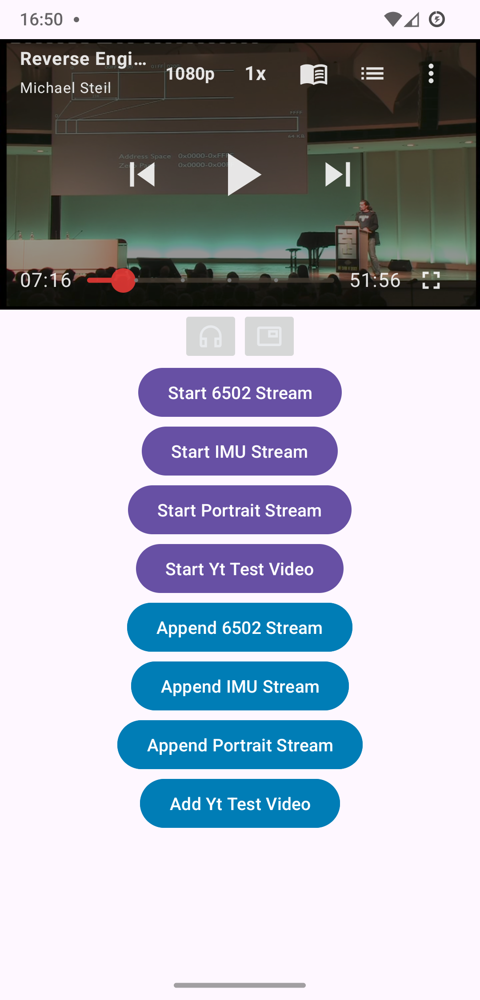
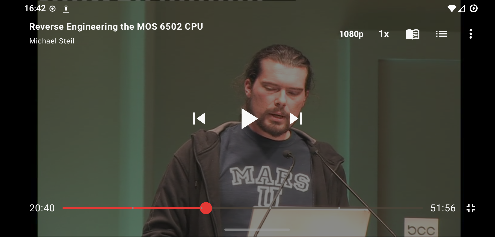
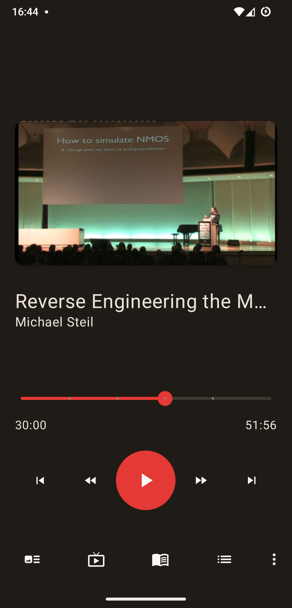
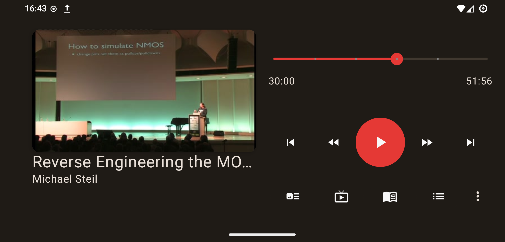
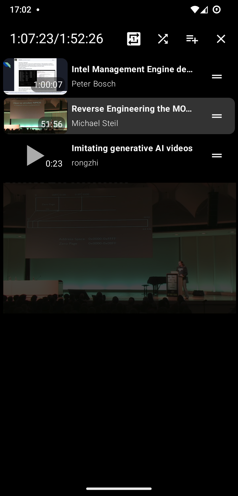
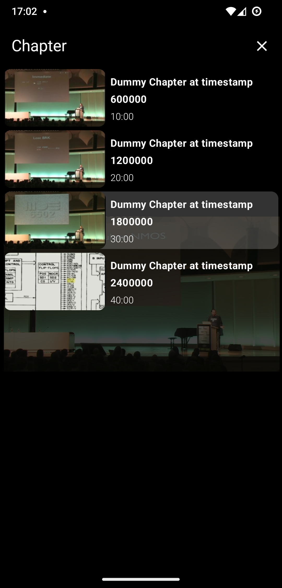
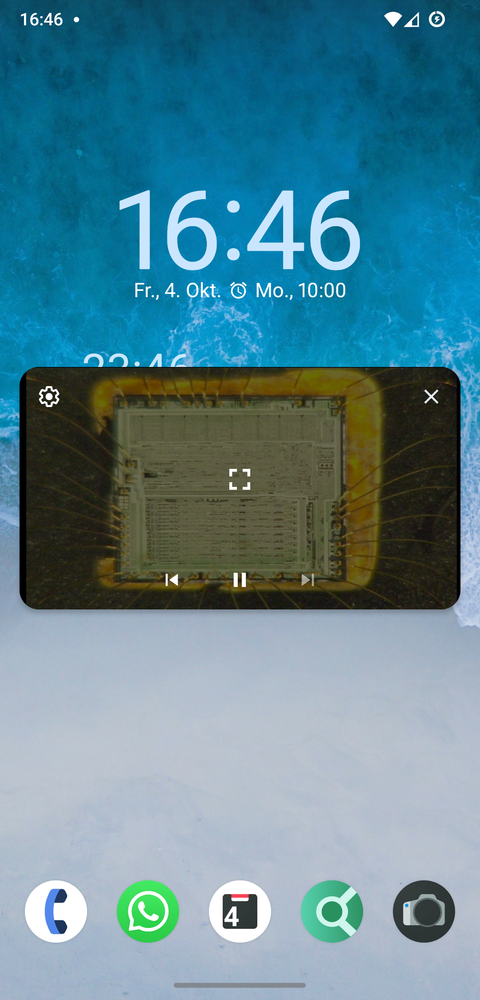
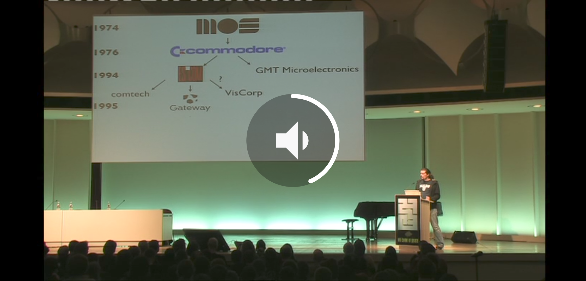
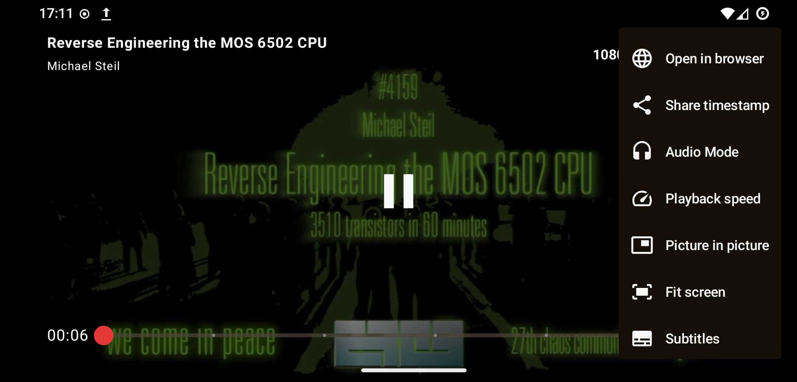

<p align="center">

</p>

<h2 align="center"><b>NewPlayer</b></h3>

<h3 align="center">NewPipe's next media player framework</h3>

<br>
<br>
<i>Icon by <a href="https://jaim3.com">Jaime López</a></i>
<br>

### So what is NewPlayer then?
NewPlayer is a media framework, which is independent of NewPipe itself. I decided to make it independent, because one of the big issues we have with the current player is that it is deeply integrated into NewPipe. Therefore, I wanted to make NewPlayer a separate module in order to enforce that the interface between NewPipe and the player is only as big as necessary. This also has the advantage that NewPlayer can be used independently of NewPipe itself, which means it can be used in other apps too.

### Let me give you a Profile about NewPlayer:
- It is a module, separate from NewPipe and can be used as an independent player framework
- It is based on the [Media3](https://developer.android.com/media/media3) library
- Its UI is created with [Jetpack Compose](https://developer.android.com/compose)
- It's fully written in Kotlin
- Its UI resembles the UI of the current NewPipe player, but improves it
- The UI uses [Material You](https://m3.material.io/blog/announcing-material-you) theming
- It follows an [MVVM](https://www.geeksforgeeks.org/mvvm-model-view-viewmodel-architecture-pattern-in-android/) architecture
- It is GPLv3 licensed
- It uses [Hilt](https://developer.android.com/training/dependency-injection/hilt-android) dependency injection

### How does NewPlayer look like?
<table>
<tr>
<td>

<br>
Embedded Screen in test App
</td>
<td>
<br>
Fullscreen
</td>
</tr>
</table>
<table>
<tr>
<td>

<br>
Audio frontend
</td>
<td>

<br>
Audio frontend landscape
</td>
</tr>
</table>

<table>
<tr>
<td>

<br>
Playlist screen
</td>
<td>

<br>
Chapter screen
</td>
<td>

<br>
Picture in Picture
</td>
</tr>
</table>
<table>
<tr>
<td>

<br>
Volume indicator
</td>
<td>

<br>
Main menu
</td>
</tr>
</table>

### Getting started

1. **Add NewPlayer to your project** 

   You can do this by adding the [JitPack](https://jitpack.io/) repository:
   ```
   implementation 'com.github.TeamNewPipe:NewPlayer:master-SNAPSHOT'
   ```

2. **Modify your Activity in the `AndroidManifest.xml`**
   - Add `android:supportsPictureInPicture="true"` to the `<activity>` tag of the activity that will hold the [NewPlayerUI](https://github.com/TeamNewPipe/NewPlayer/blob/master/new-player/src/main/java/net/newpipe/newplayer/ui/NewPlayerUI.kt)
   - Also add `android:configChanges="screenSize|smallestScreenSize|screenLayout|orientation"` to the `<activity>` tag. This will ensure a smooth transition from and to PiP mode. However, be aware that when you do this, a screen rotation or size change does not trigger an activity reconfiguration. You may have to trigger this by yourself. See [this](https://github.com/TeamNewPipe/NewPlayer/blob/72c14d39822b96420f5c71bb559b47f39dc9ed90/test-app/src/main/java/net/newpipe/newplayer/testapp/MainActivity.kt#L173-L198) code from the text app if you want to know how you could achieve this. However, bear in mind that if you use compose you might not need a screen reconfiguration at all. There just use [androidx.adaptive](https://developer.android.com/reference/kotlin/androidx/compose/material3/adaptive/package-summary) framework to handle screen rotation foo.

3. **Install NewPlayer in your Activity's layout**

    NewPlayer can be used in a [compose](https://developer.android.com/compose) as well as the classic views environment.
    - **Use NewPlayer with Compose**

      You can add NewPlayer in a compose environment by using the [`NewPlayerUI`](https://github.com/TeamNewPipe/NewPlayer/blob/72c14d39822b96420f5c71bb559b47f39dc9ed90/new-player/src/main/java/net/newpipe/newplayer/ui/NewPlayerUI.kt#L59) composable for now we will add it with a dummy view model (later more about that):
      ```kotlin
      NewPlayerUI(NewPlayerViewModelDummy())
      ```
    - **Use NewPlayer with views**

      For a views environment (and for compatibility with NewPipe before its UI refactoring), NewPlayer provides a [`NewPlayerView`]() TODO
4. **Install NewPlayer in your code**

   NewPlayer requires [Hilt](https://developer.android.com/training/dependency-injection/hilt-android) for dependency injection.


### How does NewPlayer work

NewPlayer uses [MVVM](https://www.geeksforgeeks.org/mvvm-model-view-viewmodel-architecture-pattern-in-android/) architecture design pattern.


TODO: Documentation
